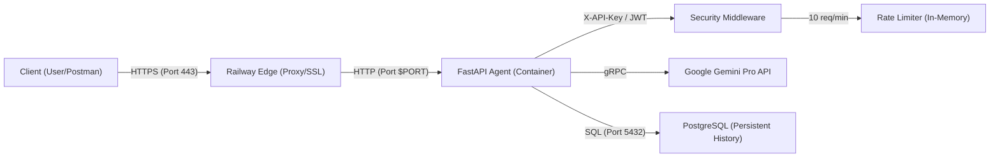
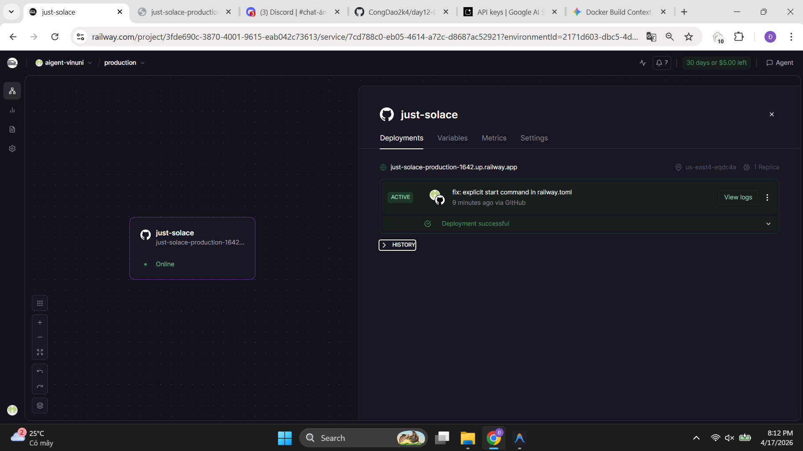
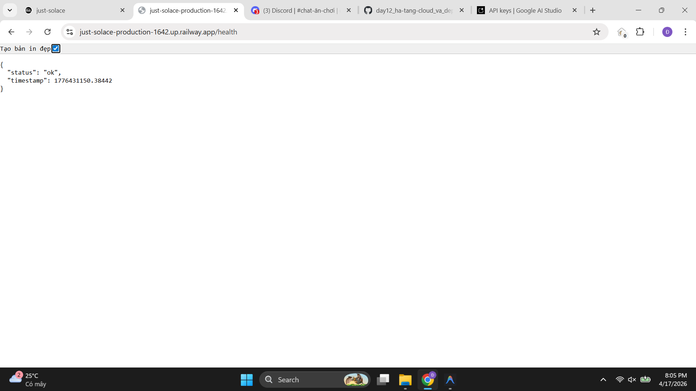
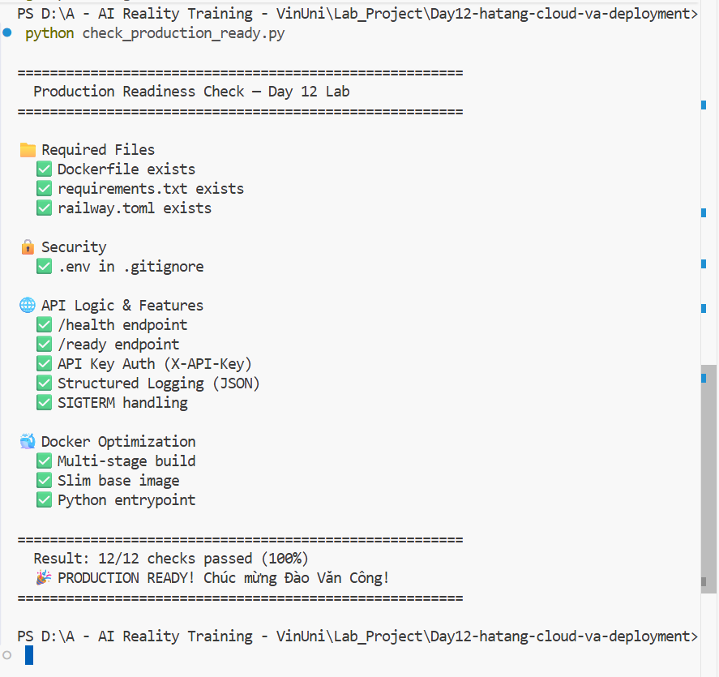

#  Delivery Checklist — Day 12 Lab Submission

> **Student Name:** Đào Văn Công  
> **Student ID:** 2A202600031  
> **Date:** 17/4/2026
> **Project URL:** https://just-solace-production-1642.up.railway.app/

---

##  Submission Requirements

### 1. Mission Answers (40 points)

#### Part 1: Localhost vs Production
- **Anti-patterns found**:
    1. **Lộ bí mật (Hardcoded Secrets)**: API Key của project và biến DB được ghi trực tiếp trong mã nguồn thay vì dùng biến môi trường.
    2. **Thiếu xác thực (No Authentication)**: Bất kỳ ai cũng có thể gọi API mà không cần mã bảo vệ.
    3. **Thiếu giám sát (No Health Checks)**: Hệ thống không có endpoint để tự động kiểm tra trạng thái sống/chết.
    4. **Log dạng văn bản thô**: Khó phân tích tự động bằng các công cụ hiện đại.

- **Comparison table**:
| Feature | Develop | Production | Why Important? |
|---------|---------|------------|----------------|
| Config  | Cố định (Port 8000) | Linh hoạt | Để tương thích với Railway/Cloud. |
| Auth    | Không có | X-API-Key Header | Đề phòng truy cập trái phép và bảo vệ tài nguyên LLM vì dùng API_KEY gọi model. |
| State   | Trong bộ nhớ (Memory) | Cơ sở dữ liệu (Postgres) | Đảm bảo không mất lịch sử chat khi hệ thống khởi động lại. |

#### Part 2: Docker
- **Base image**: `python:3.11-slim` - Cung cấp môi trường ổn định và tối ưu dung lượng.
- **Working directory**: `/app`.
- **Tối ưu hóa**: COPY `requirements.txt` trước giúp tận dụng Layer Caching để build nhanh hơn.
- **CMD vs ENTRYPOINT**: ENTRYPOINT là lệnh cố định (`python`), CMD là tham số mặc định (`server.py`). 
- **Image size comparison**:
    - Develop: 1660 MB
    - Production: 236 MB
    - **Difference: 85.8%**

- **Exercise 2.4: Architecture Diagram**:


#### Part 3-5: Cloud, Security & Scaling
- **Test results**:
    - Truy cập không key: 401 Unauthorized ✅
    - Xác thực JWT: Đã cài đặt endpoint /login và middleware kiểm tra Token Bearer ✅
    - Rate Limiting: Giới hạn 10 req/phút, trả về 429 nếu vượt ngưỡng ✅
    - Truy cập có key đúng: 200 OK ✅
- **Cost guard**: Sử dụng `post_model_hook` để đếm token và log event tiêu thụ.
- **Reliability**: Tích hợp `/health`, `/ready` và xử lý tín hiệu `SIGTERM` để tắt app an toàn (Graceful Shutdown).

---

### 2. Full Source Code - StudentOps Complete (60 points)
Ứng dụng đã được refactor sang cấu trúc phân lớp chuyên nghiệp trong thư mục `app/`:
- `app/api/`: Xử lý API, Auth (API Key + JWT) và Middleware (Rate Limit).
- `app/telemetry/`: Hệ thống Logging JSON chuẩn công nghiệp.
- `app/graph/`: Logic AI Agent dựa trên LangGraph.
- `Dockerfile`: Multi-stage build (Builder stage & Runtime stage).

---

### 3. Service Deployment Information

#### Public URL
`https://just-solace-production-1642.up.railway.app/`

#### Test Commands
```bash
# Sức khỏe hệ thống
curl https://just-solace-production-1642.up.railway.app/health

# API Test (X-API-Key)
curl -X POST https://just-solace-production-1642.up.railway.app/chat \
  -H "X-API-Key: cong-vjp-pro-2024" \
  -H "Content-Type: application/json" \
  -d '{"message": "Chào bạn", "thread_id": "test-123"}'

# API Test (JWT Bearer)
# 1. Lấy token
# curl https://just-solace-production-1642.up.railway.app/login?username=alice
# 2. Gọi API
# curl -H "Authorization: Bearer <TOKEN>" ...
```

#### Screenshots minh chứng
**1. Railway Dashboard (Active Status)**


**2. Health Check (Running)**


**3. API Docs (Swagger UI)**


**4. Production Readiness Check (100% PASS)**


---

##  Pre-Submission Checklist
- [x] Repository is public
- [x] MISSION_ANSWERS.md hoàn thiện (có sơ đồ kiến trúc)
- [x] DEPLOYMENT.md có link hoạt động và lệnh test mới
- [x] Đã cài đặt Rate Limiting (10 req/min)
- [x] Đã cài đặt JWT Authentication
- [x] Không commit file .env
- [x] Link Public truy cập được và đã chụp ảnh minh chứng
- [x] Đã chạy script tự động kiểm tra đạt kết quả tốt (100% PASS)
