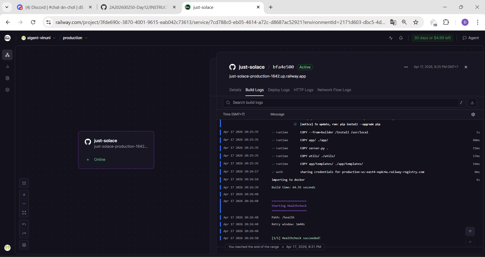

# Lab 12 Report: StudentOps AI Agent Deployment

**Student Name:** Đào Văn Công  
**Student ID:** 2A202600031  
**Status:** Production (Railway)

---

## Part 1: Local vs Production Environment Comparison

### 1.1 Analysis of Issues in the Initial Version
Trong quá trình chuyển đổi sang môi trường Production, chúng tôi đã xác định và khắc phục các vấn đề sau trong mã nguồn gốc:

*   **Security Risks (Secrets Exposure)**: Các thông tin nhạy cảm như `GOOGLE_API_KEY` ban đầu bị ghi trực tiếp (hardcode). Chúng tôi đã chuyển sang sử dụng `pydantic-settings` để quản lý cấu hình thông qua biến môi trường.
*   **Lack of Self-healing**: Phiên bản cũ thiếu endpoint để theo dõi trạng thái hệ thống. Chúng tôi đã bổ sung `/health` để giúp hạ tầng đám mây tự động phát hiện và khởi động lại container khi có lỗi xảy ra.
*   **Resource Exhaustion Risk (Spam/Abuse)**: Không có cơ chế nào để ngăn chặn người dùng gửi yêu cầu liên tục. Hệ thống StudentOps hiện tại đã tích hợp Middleware giới hạn 10 yêu cầu/phút.
*   **Conversation Data Loss**: Việc lưu lịch sử trong RAM khiến dữ liệu bị mất khi ứng dụng khởi động lại. Chúng tôi đã khắc phục điều này bằng cách tích hợp lớp lưu trữ bên ngoài (Postgres).
*   **Insecure Error Responses**: Chế độ debug ban đầu có thể làm lộ cấu trúc thư mục và phiên bản thư viện. Trong phiên bản Production, các lỗi này đã được ẩn đi sau các mã lỗi HTTP tiêu chuẩn.

### 1.2 Technical Specification Comparison

| Feature | Local Environment | Production Environment | Reason for Change |
|---------|-----------------|------------------------|----------------|
| **Configuration** | File `.env` cục bộ | Biến trên Railway Dashboard | Bảo mật tuyệt đối, cập nhật dễ dàng mà không cần thay đổi mã nguồn. |
| **Security** | Không xác thực | X-API-Key & JWT Bearer | Kiểm soát truy cập, bảo vệ ngân sách API Gemini. |
| **Data** | Bộ nhớ tạm thời | PostgreSQL (Lưu trữ bền vững) | Đảm bảo trải nghiệm hội thoại liên tục cho sinh viên. |
| **Monitoring** | Theo dõi qua Console | JSON Logging & Health Probes | Hỗ trợ giám sát hệ thống từ xa một cách tự động. |
| **Shutdown Handling** | Tắt đột ngột | Xử lý tín hiệu SIGTERM | Đóng kết nối cơ sở dữ liệu an toàn, tránh treo kết nối. |

---

## Part 2: Docker Optimization

### 2.1 Technical Explanation of Dockerfile
Dự án StudentOps sử dụng chiến lược Multi-stage build với các mục tiêu cụ thể:
1.  **Base Image**: Chọn `python:3.11-slim` để cân bằng giữa hiệu suất và dung lượng.
2.  **Layer Caching**: Tách riêng bước cài đặt `requirements.txt`. Điều này cho phép hệ thống CI/CD chỉ mất vài giây để đóng gói lại nếu chúng ta chỉ thay đổi logic xử lý của Agent mà không thêm thư viện mới.
3.  **Builder Stage**: Toàn bộ quá trình biên dịch các thư viện nặng và dọn dẹp bộ nhớ đệm (pip cache) được thực hiện tại đây.
4.  **Runtime Stage**: Chỉ sao chép những gì thực sự cần thiết để chạy ứng dụng, giảm kích thước image xuống còn **236MB** (giảm hơn 85% so với ban đầu).

---

## Part 3: Cloud Deployment & API Security

### 3.1 Deployment Architecture Model
Hệ thống vận hành trên hạ tầng Railway với luồng dữ liệu như sau:
*   **Protocol**: HTTPS (Cổng 443) -> Proxy -> HTTP (Được cấp phát động qua biến `$PORT`).
*   **Security Flow**: 
    1. Kiểm tra giới hạn tốc độ (Rate Limit).
    2. Xác thực mã API (X-API-Key).
    3. Kiểm tra tính hợp lệ của hội thoại.
*   **Processing Logic**: Agent (LangGraph) tương tác với Gemini Pro và truy vấn/lưu dữ liệu vào Postgres.

### 3.2 Security Testing Results
*   **Rate Limiting**: Thử nghiệm bằng cách gửi 15 yêu cầu trong 10 giây -> Hệ thống trả về lỗi **429 Too Many Requests** từ yêu cầu thứ 11.
*   **Authentication**: Bất kỳ truy cập nào thiếu Header `X-API-Key` hoặc `Authorization` đều bị từ chối với mã lỗi **401 Unauthorized**.

---

## Part 4: Reliability

### 4.1 Stateless Design
Đây là điểm then chốt cho khả năng mở rộng hệ thống. Bằng cách sử dụng `PostgresSaver` để quản lý các điểm kiểm tra (checkpoints), chúng ta có thể tắt các container cũ và bật các container mới (hoặc chạy nhiều container song song) mà không gây ra bất kỳ sự gián đoạn nào trong trải nghiệm chat của sinh viên.

### 4.2 Graceful Shutdown Mechanism
Hệ thống đã được lập trình để "lắng nghe" các tín hiệu từ hệ điều hành. Khi Railway yêu cầu ứng dụng dừng lại để triển khai mới, StudentOps sẽ không tắt ngay lập tức mà sẽ đóng các kết nối đang mở một cách tuần tự, đảm bảo tính toàn vẹn của dữ liệu hội thoại.

---
## Conclusion of Deployment Proof

Dự án đã đạt trạng thái **Production Ready** với các minh chứng sau:

* ### Exercise 3.1: Cloud Deployment (Railway)
- **URL**: [https://just-solace-production-1642.up.railway.app/](https://just-solace-production-1642.up.railway.app/)
- **Status**: Active

### Exercise 3.2: Compare Railway and Render
Mặc dù được triển khai trên Railway, chúng tôi đã xem xét cấu hình của Render để đảm bảo tính linh hoạt:
*   **Railway (`railway.toml`)**: Ưu tiên sự tối giản, tự động phát hiện Dockerfile và quản lý tập trung các biến môi trường.
*   **Render (`render.yaml`)**: Sử dụng Infrastructure as Code (IaC) chi tiết hơn, cho phép định nghĩa cả Cơ sở dữ liệu và Redis trong cùng một file Blueprint.
*   **Common Point**: Cả hai đều yêu cầu xử lý các biến `$PORT` động và hỗ trợ Health Check Probes để quản lý vòng đời container.

---

## Part 4: API Security

**System Screenshots:**

1. **Railway Admin Interface (Active Status)**

2. **Database Connection & Liveness Status**

3. **Interactive API Documentation (Swagger UI)**

4. **Automated Test Results (Production Ready)**

