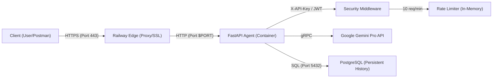

# Day 12 Lab - Mission Answers: StudentOps AI Agent
**Học viên:** Đào Văn Công  
**MSSV:** 2A202600031

---

## Part 1: Localhost vs Production

### Exercise 1.1: Anti-patterns found
1. **Lộ bí mật (Hardcoded Secrets)**: API Key của project và biến DB được ghi trực tiếp trong mã nguồn thay vì dùng biến môi trường.
2. **Thiếu xác thực (No Authentication)**: Bất kỳ ai cũng có thể gọi API mà không cần mã bảo vệ.
3. **Thiếu giám sát (No Health Checks)**: Hệ thống không có endpoint để tự động kiểm tra trạng thái sống/chết.
4. **Log dạng văn bản thô**: Khó phân tích tự động bằng các công cụ hiện đại.

### Exercise 1.3: Comparison table
| Feature | Develop | Production | Why Important? |
|---------|---------|------------|----------------|
| Config  | Cố định (Port 8000) | Linh hoạt | Để tương thích với Railway/Cloud. |
| Auth    | Không có | X-API-Key Header | Đề phòng truy cập trái phép và bảo vệ tài nguyên LLM vì dùng API_KEY gọi model. |
| State   | Trong bộ nhớ (Memory) | Cơ sở dữ liệu (Postgres) | Đảm bảo không mất lịch sử chat khi hệ thống khởi động lại. |

## Part 2: Docker

### Exercise 2.1: Dockerfile questions
1. **Base image**: `python:3.11-slim`
2. **Working directory**: `/app`
3. **Layer Caching**: COPY `requirements.txt` trước giúp tận dụng bộ nhớ đệm của Docker để build nhanh hơn nếu code thay đổi mà thư viện giữ nguyên.
4. **CMD vs ENTRYPOINT**: ENTRYPOINT là lệnh cố định (như `python`) và CMD là các tham số mặc định (như `server.py`). Có thể ghi đè CMD khi chạy lệnh `docker run` nhưng ENTRYPOINT thì không.

### Exercise 2.3: Image size comparison
- Develop: 1660 MB
- Production: 236 MB
- **Chênh lệch**: 85.8%

### Exercise 2.4: Architecture Diagram
Dưới đây là sơ đồ luồng dữ liệu và kết nối hạ tầng của hệ thống:

## Part 3: Cloud Deployment

### Exercise 3.1: Railway deployment
- **URL**: [https://just-solace-production-1642.up.railway.app/](https://just-solace-production-1642.up.railway.app/)
- **Status**: Active
- **Screenshot**:

## Part 4: API Security

### Exercise 4.1-4.3: Test results
- **Không Key**: Trả về 401 Unauthorized ✅.
- **Xác thực JWT**: Đã cài đặt endpoint `/login` và middleware kiểm tra Token Bearer ✅.
- **Rate Limiting**: Giới hạn 10 req/phút, trả về 429 nếu vượt ngưỡng ✅.
- **Có Key đúng**: Trả về 200 OK cùng nội dung từ AI ✅.

## Part 5: Scaling & Reliability

### Exercise 5.1-5.5: Implementation notes
- **Liveness/Readiness**: Tích hợp các endpoint `/health` và `/ready` để hạ tầng đám mây tự động phát hiện lỗi.
- **Graceful Shutdown**: Xử lý tín hiệu `SIGTERM` để đảm bảo đóng kết nối Database an toàn trước khi container bị tắt.
- **Stateless Design**: Thiết kế không lưu trạng thái trong app để có thể chạy nhiều bản sao cùng lúc.
